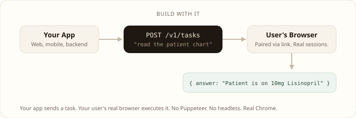

<div align="center">

[English](../../README.md) | [中文](README.md)


# Agent Browse

**浏览 agent 的上下文层。**

你的浏览 agent 总是在真实网站上翻车 —— X 用的是 Draft.js、LinkedIn 的 connect 按钮藏起来、<br/>
Gmail 要用键盘快捷键。Agent Browse 自带 24 份站点 playbook ——<br/>
**给 LLM 的提示，不是脆弱的脚本** —— 让 agent 真正能把任务跑完。

[](../../LICENSE)

**适配** Claude Code · Cursor · Codex · Gemini CLI · VS Code · Kiro · Antigravity · OpenCode

</div>

<br/>

> **这是一个私有的加固分支**，fork 自 [hanzi-browse](https://github.com/hanzili/hanzi-browse)：
> 移除了遥测、移除了对托管服务的外发请求、relay 仅绑定 loopback、冻结了自动更新。
> 仅支持 **BYOM 本地模式** —— 页面内容和截图只会发给你自己配置的模型提供方。
> 日常使用见 [`hardened/MANUAL.md`](../../hardened/MANUAL.md)，改动细节见
> [`hardened/HARDENING.md`](../../hardened/HARDENING.md)。

<br/>

## 使用 Agent Browse 的两种方式

底层是同一套 24 份站点 playbook，区别只是谁在驱动它。

### 给你的 agent —— 给你的编程 agent 配一个浏览器子 agent

`npx hanzi-browse setup` 会检测你机器上所有 AI agent（Claude Code、Cursor、Codex 等），自动把 Agent Browse 配成它们的 MCP 工具。主 agent 把浏览器工作委托出去；子 agent 自己跑循环 —— *读页面 → 规划下一步 → 点击/输入/滚动 → 观察结果 → 重复直到完成* —— 然后返回一个干净的答案。站点 playbook 按 URL 自动加载，模型不用再摸索网站的坑。


### 集成到产品里 —— 用自然语言描述的浏览器自动化

你的后端调用 `runTask({ task: "…" })`。真正执行的是你用户自己的 Chrome（已登录成他们自己）。底层 playbook 和 CLI 完全一样，对外包装成 REST API 和 `@hanzi-browse/sdk`。（本分支的托管端点已停用 —— 要用这条路径，请自行部署 `server/`。）



<br/>

## 快速开始

```bash
npx hanzi-browse setup
```

这一个命令会把主要步骤都串起来：

```text
npx hanzi-browse setup
│
├── 1. 检测浏览器 ───── Chrome、Brave、Edge、Arc、Chromium
│
├── 2. 安装扩展 ────── 以 unpacked 方式加载构建好的扩展
│
├── 3. 检测 AI agent ─ Claude Code、Cursor、Codex、Windsurf、
│                      VS Code、Gemini CLI、Amp、Cline、Roo Code
│
├── 4. 配置 MCP ───── 将 hanzi-browse 合并进各 agent 的配置
│
├── 5. 安装技能 ───── 把浏览器相关技能复制到各 agent
│
└── 6. 选择 AI 模式 ── BYOM（使用你自己的模型 / key）
```

**BYOM**：Bring Your Own Model。你可以使用 Claude Pro/Max、GPT Plus 或自己的 API Key。本地运行，除了发给你配置的模型提供方，数据不会离开你的机器。

> 本分支主打的加固版专属浏览器 profile 配置流程，请按
> [`hardened/MANUAL.md`](../../hardened/MANUAL.md) §3 操作，而不是用安装向导。
>
> 如果你在中国区网络环境、Windows PowerShell，可再看 [中文安装指南](./setup-guide.md)。

<br/>

## 示例

```text
"打开 Gmail，帮我退订最近一周的营销邮件"
"去 careers.acme.com 帮我投递 senior engineer 岗位"
"登录我的银行账户，把上个月账单下载下来"
"去 LinkedIn 帮我找旧金山的 AI 工程师岗位"
```

<br/>

## Skills

安装向导会自动把浏览器技能装进你的 agent。技能的作用，是教 agent 在什么场景下该用浏览器，以及该怎么用浏览器完成特定流程。

| Skill | 说明 |
|-------|------|
| `agent-browse` | 核心技能，定义何时以及如何使用浏览器自动化 |
| `e2e-tester` | 在真实浏览器里测试你的应用，并带截图反馈问题 |
| `social-poster` | 按不同平台改写文案，并用你已登录的账号发布 |
| `linkedin-prospector` | 寻找潜在客户或候选人，并发送个性化连接请求 |
| `a11y-auditor` | 在真实浏览器里执行无障碍检查 |
| `data-extractor` | 从网站中提取结构化数据，输出为 CSV/JSON |
| `x-marketer` | 面向 Twitter / X 的营销工作流 |

技能都在 [`server/skills/`](../../server/skills/) 里，放一个 `SKILL.md` 就能加自己的。

<br/>

## 站点 playbook —— 上下文层

CLI 和 SDK 共享同一套 **站点 playbook** —— 针对复杂网站验证过的交互手册。它们告诉 LLM：X 页面怎么处理异步加载、LinkedIn 的 connect 按钮该用哪个选择器、Gmail 怎么用键盘快捷键操作，以及另外 ~20 个站点各自的坑怎么绕。

**给 LLM 的提示，不是脆弱的脚本。** 模型始终在掌舵，我们只是把小抄塞给它。DOM 改了，agent 会自己适应 —— 没有 adapter 要重写。

**当前覆盖 24 个站点：** X、LinkedIn、Gmail、GitHub、Notion、Figma、Slack、Reddit、Amazon、eBay、Walmart、Target、Zillow、Apartments.com、Craigslist、Indeed、Google Docs、Sheets、Calendar、Drive、ChatGPT、Claude.ai、Stack Overflow。

所有 playbook 都在 [`server/src/agent/domain-skills.json`](../../server/src/agent/domain-skills.json) 里，就是一个 JSON 数组。要加新站点，追加一条 `{ domain, skill }` 就行。

<br/>

## SDK

把浏览器自动化嵌进自己的产品里。你的应用调用 API，真实浏览器执行任务，然后把结果返回给你。本分支的托管端点已停用 —— 请把 SDK 指向你自己部署的 `server/`。

```typescript
import { HanziClient } from '@hanzi-browse/sdk';

const client = new HanziClient({ apiKey: process.env.HANZI_API_KEY, baseUrl: 'https://your-deployment.example.com' });

const { pairingToken } = await client.createPairingToken();
const sessions = await client.listSessions();

const result = await client.runTask({
  browserSessionId: sessions[0].id,
  task: 'Read the patient chart on the current page',
});
console.log(result.answer);
```

[示例集成](../../examples/partner-quickstart/)

<br/>

## 工具

| Tool | 说明 |
|------|------|
| `browser_start` | 发起一个任务，并阻塞等待直到任务完成 |
| `browser_message` | 向现有会话发送后续指令 |
| `browser_status` | 查询任务进度 |
| `browser_stop` | 停止任务 |
| `browser_screenshot` | 截取当前页面 |

<br/>

## 开发

**前置条件：** [Node.js 18+](https://nodejs.org/) 和 [Docker Desktop](https://docs.docker.com/get-docker/)（必须已经启动）。

### 第一次运行

```bash
git clone https://github.com/hanzili/hanzi-browse
cd hanzi-browse
make fresh
```

这个命令会检查环境、从模板生成 `.env`、安装依赖、完成构建、启动 Postgres、执行数据库迁移，并拉起本地开发服务。整个过程大约 90 秒。

### 之后每次启动

```bash
make dev
```

它会启动 Postgres、执行迁移，并拉起开发服务。Dashboard 地址是 [localhost:3456/dashboard](http://localhost:3456/dashboard)。

### 常用命令

| Command | 说明 |
|---------|------|
| `make fresh` | 首次完整初始化（检查依赖 + 安装 + 构建 + 数据库 + 启动） |
| `make dev` | 启动全部开发服务（数据库 + 迁移 + server） |
| `make build` | 重新构建 server、dashboard 和 extension |
| `make stop` | 停止 Postgres |
| `make clean` | 停止并删除数据库卷 |
| `make check-prereqs` | 检查 Node 18+ 和 Docker 是否可用 |
| `make help` | 查看全部命令 |

### 配置

`.env.example` 的默认值足够把本地服务跑起来。下面这些服务是可选的：

- **Google OAuth**（dashboard 登录）—— 在 `.env` 里补充 `GOOGLE_CLIENT_ID` / `GOOGLE_CLIENT_SECRET`
- **Vertex AI**（托管模式任务执行）—— 具体步骤见 `.env.example`

### 手动加载扩展

打开 `chrome://extensions`，开启 Developer Mode，点击 “Load unpacked”，选择仓库根目录（包含 `manifest.json` 的文件夹）。

### 验证一切正常

`make dev` 启动后，加载好扩展：

```bash
# 在另一个终端运行：
node server/dist/cli.js start "Go to example.com and tell me the page title"
```

应该会看到 Chrome 窗口打开，agent 导航到 example.com，然后返回页面标题。如果成功，说明 relay + 扩展 + agent loop 全部连通。

<br/>

## 参与贡献

欢迎提交贡献，具体说明见 [CONTRIBUTING.md](../../CONTRIBUTING.md)。

<br/>

## 隐私

本分支仅以 **BYOM 本地模式** 运行，不会把数据发送到任何托管服务 —— 截图和页面内容只会发给你配置的模型提供方。完整说明见[隐私政策](../../PRIVACY.md)。

## License

[Polyform Noncommercial 1.0.0](../../LICENSE)
